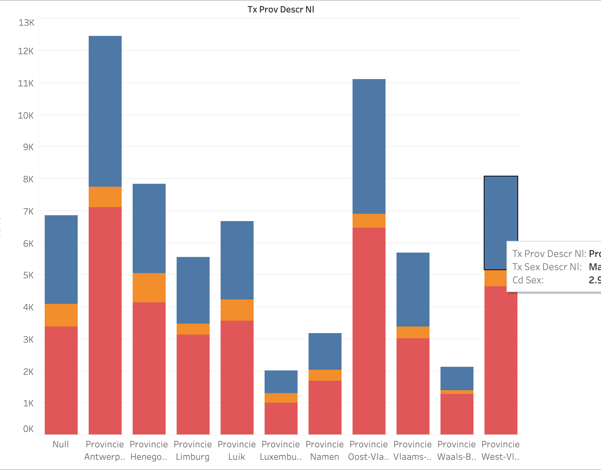

# Het project?

We hebben een dataset: 

*Verkeersongevallen met doden en gewonden, per datum, dag van de week, tijdstip van de dag en diverse andere ongevalsfactoren. 
url: https://statbel.fgov.be/nl/open-data/verkeersongevallen-2019*

Belangrijke ongevalsgegevens:

- leeftijd
- geslacht
- weekdag
- type weg
- type persoon van sterfte
- binnen/buiten bebouwde kom
- leeftijd

Deze data gaan we visualiseren aan de hand van *Tableau Public.* Dit is een programma met een gebruiksvriendelijke interface waar weinig coding aan te pas komt. 

Het voordeel is dat het handig is om snel inzichten te gaan creëren, maar het geeft natuurlijk minder vrijheid in het uiteindelijke resultaat. 

Bepaalde interessante inzichten dat we hieruit kunnen halen:

- Welk geslacht heeft meer sterfte gevallen
- Hoeveel gevallen zijn er in elke provincie?
- Welke leeftijden hebben de meeste ongevallen, welke de minste
- etc.

