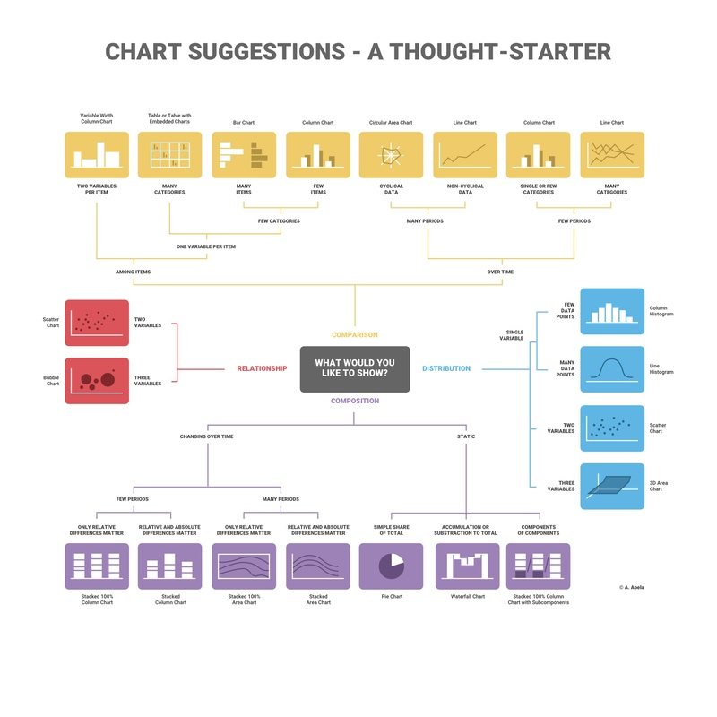

# Hoe nuttige visualisaties genereren?

Om een dataset te visualiseren moeten we eerst en vooral een tool gaan kiezen. Er zijn heel veel tools om data te visualiseren; tools gebaseerd op python, maar ook op javascript. Er is ook software beschikbaar waar geen coding te pas komt. We gaan voor beiden enkele voorbeelden bespreken.

Als we de juiste tool hebben gevonden moeten we uiteraard gaan beslissen welke data uit onze dataset we willen overbrengen en met welke typen grafieken we dit gaan doen. We moeten ons afvragen welke boodschap we willen overbrengen en welke inzichten we daarvoor nodig hebben. Daarbij overlopen we ook kort wat zoal de best practices zijn voor enkele populaire grafiek typen.

Tot slot, om onze boodschap zo duidelijk mogelijk te maken en toegankelijk voor zo veel mogelijk mensen, moeten we onze grafieken in een verhaal gaan gieten. De principes van storytelling zijn hier dus ook zeker heel belangrijk. We gaan kort eens kijken hoe we onze grafieken zo kunnen samenstellen dat we een boeiend totaal plaatje bekomen.

## Tools

### Coding

- [JupyterLab](https://jupyter.org)

    JupyterLab is een ontwikkelingsomgeving voor het maken van Jupyter Notebooks. Dit zijn documenten waar live code wordt uitgevoerd. Op die manier kunnen er binnen in het document berekeningen gedaan worden en data interactief gevisualiseerd worden. Dit is dus zeer handig om een verhaal te vertellen in één document. Het nadeel is wel dat er niet veel opmaak mogelijkheden zijn. Deze notebooks worden dus eerder gebruikt voor het visualiseren en vertellen van wetenschappelijk onderzoek. Zoals misschien uit de naam afgeleid kan worden deze notebooks geschreven in Python.

- [plotly.js](https://plotly.com/javascript/)

    Een javascript library die het toelaat om data om te zetten naar grafieken. De library is gebaseerd op d3.js en [stack.gl](http://stack.gl). d3.js is een library om met data te kunnen werken en stack.gl is een *software ecosystem* om visualisaties in de browser te tonen. Plotly.js is perfect als je niet direct in de ingewikkelde python code wilt duiken maar relatief snel je grafieken wilt genereren. Met 40 grafiek typen (inclusief 3D grafieken) kan je zeker de gepaste grafieken maken voor jouw data.

### No coding

- [Google charts](https://developers.google.com/chart)

    Google Charts is vooral bedoelt om op je website live data te gaan visualiseren. Zoals alle tools van google is het zeer gebruiksvriendelijk en gratis. Het nadeel is wel dat je gebonden bent aan de stijl van google om de charts op te maken. 

- [public tableau](https://public.tableau.com/en-us/s/)

    Deze tool is gericht op het makkelijk creëeren van inzichten en het vertellen van een verhaal met je data. Ook deze tool is heel gebruiksvriendelijk en na een beetje uitproberen kan je al snel grafieken maken met je data files.

## De juiste grafieken kiezen

Eerst en vooral is het belangrijk dat we gaan bepalen wat we allemaal willen laten zien. Er ziijn vier soorten verbanden die we kunnen gaan visualiseren:

### Relatie *(Eng.: relation)*

Er wordt een bepaalde correlatie (maten van samenhang) tussen twee variabelen getoond. Hiervoor us de spreidingsplot (Eng.: scatter chart) het beste. Onderstaande spreidingsplots hebben (links) een grote positieve en (rechts) een negatieve correlatie coëfficiënt. 

Correlatie is dus kortweg de mate waarin de datapunten op een spreidingsplot op één lijn liggen.  

Zie ook: [lineaire regressie](https://wikistatistiek.amc.nl/index.php/Lineaire_regressie)

Indien je met drie variabelen zit, kan je de grootte van de bolletjes gebruiken om die variabele te vertegenwoordigen.

### Vergelijking *(Eng.: comparison)*

Hierbij wordt data met elkaar vergeleken. Verschillende items worden naast elkaar gevisualiseerd zodat er een duidelijk verschil te zien is. Vaak wordt dit verschil ook in functie van de tijd weergegeven.

### Samenstelling *(Eng.: composition)*

De samenstellingsgrafieken  worden gebruikt om verschillende delen van een totaal weer te geven. Een bekend voorbeeld hiervan is het taartdiagram. Om de evolutie in compositie van een totaal weer te geven wordt deze soms ook in functie van de tijd weergegeven, zoals bij de *stacked area chart*.

### Verdeling *(Eng.: distribution)*

Om te laten zien hoe bepaalde variabelen verdeeld zijn over de tijd gebruiken we een verdelingsgrafiek. Een bekend voorbeeld hiervan is het histogram.

Image form [https://infogram.com/page/choose-the-right-chart-data-visualization](https://infogram.com/page/choose-the-right-chart-data-visualization)

## Best practices

### Lijn grafieken

- Zorg voor duidelijk benoemde assen.
- Houd het zo simpel mogelijk. Geen raster als er geen specifieke gegevens moeten worden afgelezen en gebruik zo weinig mogelijk lijnen.
- Gebruik een goede schaal en bereik van de assen. Als uw data set geen gegevens rond de nul heeft, hoeft je as ook niet van nul te beginnen.

### Taartdiagrammen

- Bij percentages, zorg dat je totaal 100% is.
- Gebruik geen 3D, de hoeken maken het moeilijkere om de data correct te interpreteren.

### Kolom grafieken

- Zorg ook hier voor goede labels op de assen.
- Zet data in de verschillende kolommen, om nauwkeurig data te kunnen aflezen.
- Gebruik niet te veel kleuren. Je kan desnoods verschillende tinten van dezelfde kleur gebruiken.

### tbc

## Maak er een verhaal van

Zoals we eerder besproken, is het doel van data visualisatie om data duidelijk te maken voor de mens. We moeten dus een bepaald verhaal vertellen aan de hand van grafieken. Hier zijn dus de principes van story  telling zeker relevant.

## Bronnen van open data

- [https://www.data.stad.gent](https://data.stad.gent)
- [https://data.worldbank.org](https://data.worldbank.org/)
- [https://www.who.int/gho/database/en/](https://www.who.int/gho/database/en/)
- [https://statbel.fgov.be/nl/open-data](https://statbel.fgov.be/nl/open-data)